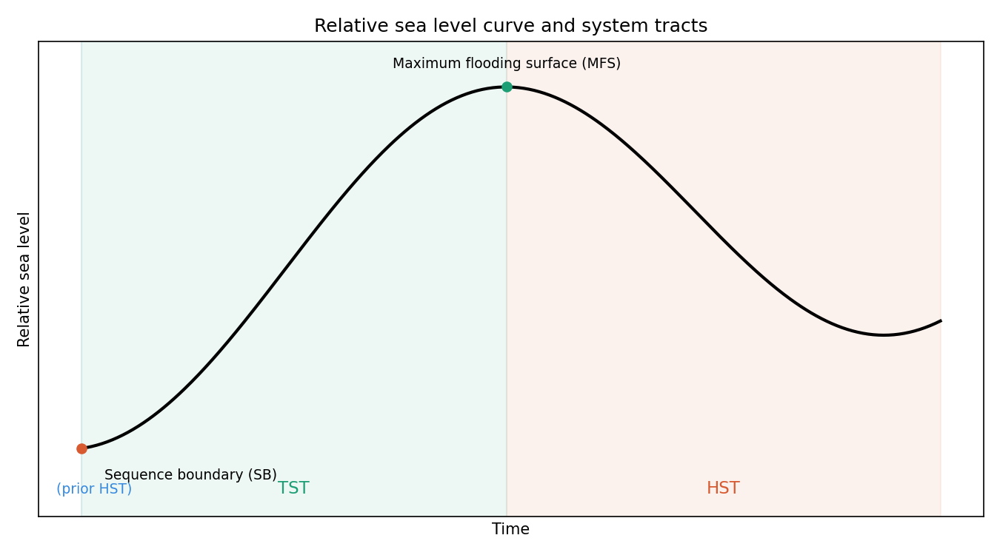

# Sequence stratigraphy fundamentals

Short technical notes on sequence stratigraphy concepts, written while
refreshing basin analysis and petroleum systems fundamentals.

## Core concepts

- **Accommodation space** — the total volume available for sediment to
  accumulate in a basin, controlled by the combination of (relative)
  sea level change and tectonic subsidence.
- **Sequence boundary (SB)** — marks the lowest point of relative sea
  level in a cycle. Often expressed as a subaerial erosion surface at
  the shelf edge, but passes basinward into a correlative conformity
  (no erosion, just a continuous surface) in deeper, never-exposed
  parts of the basin.
- **Lowstand systems tract (LST)** — sediment deposited while relative
  sea level is low; coarse material can bypass the shelf and reach
  the deep basin, making LST a common reservoir target.
- **Transgressive systems tract (TST)** — deposited while sea level is
  rising. Coarse sediment gets trapped near the shoreline (sediment
  starvation), so the basin becomes progressively finer-grained
  basinward.
- **Maximum flooding surface (MFS)** — the point of maximum
  transgression / highest relative sea level within a cycle. Sediment
  input is minimal here, favoring organic matter enrichment — often
  the best source rock and/or top seal candidate.
- **Highstand systems tract (HST)** — deposited while sea level is
  still high but beginning to fall; the shoreline progrades
  (regresses) again, but coarse sediment mostly stays on the shelf
  rather than reaching the deep basin (unlike LST).

## Why it matters commercially

Reservoir, source, and seal rock tend to sort into different systems
tracts:
- LST → often reservoir (coarse, basinward-reaching sand)
- MFS → often source rock and/or seal (organic-rich, low net-to-gross)
- TST → often the sealing unit capping LST sands

Petroleum system risk mapping (e.g. CRS/common risk segment mapping,
as used by companies like Neftex) is built on layering these
individual element maps to find areas where source, reservoir, and
trap all coincide.

## Relevance to the Thrace Basin project

TOC, pyrolysis, porosity, and vitrinite reflectance work done on
Eocene-Oligocene deltaic/turbiditic flysch systems maps directly onto
this framework: those coarser turbiditic/deltaic systems are typically
LST-type deposits (sediment bypassing the shelf into the deep basin),
while the organic-rich intervals assessed for source rock potential
sit closer to MFS-type conditions.

## Relative sea level curve (synthetic)

A simple synthetic curve illustrating how system tracts map onto a
single relative sea level cycle: TST during the rise toward MFS, HST
during the subsequent slow fall.

```python
import numpy as np
import matplotlib.pyplot as plt

t = np.linspace(0, 2 * np.pi * 1.05, 500)
sea_level = -np.cos(t) + 0.12 * t  # trough at t=0 (SB), peak near t=pi (MFS)

fig, ax = plt.subplots(figsize=(9, 5))
ax.plot(t, sea_level, color="black", linewidth=2)

sb_idx = np.argmin(sea_level[:60])
mfs_idx = np.argmax(sea_level)

ax.scatter(t[sb_idx], sea_level[sb_idx], color="#D85A30", zorder=5)
ax.annotate("Sequence boundary (SB)", (t[sb_idx], sea_level[sb_idx]),
            textcoords="offset points", xytext=(15, -20), ha="left", fontsize=9)

ax.scatter(t[mfs_idx], sea_level[mfs_idx], color="#1D9E75", zorder=5)
ax.annotate("Maximum flooding surface (MFS)", (t[mfs_idx], sea_level[mfs_idx]),
            textcoords="offset points", xytext=(0, 12), ha="center", fontsize=9)

ax.axvspan(t[sb_idx], t[mfs_idx], color="#1D9E75", alpha=0.08)
ax.axvspan(t[mfs_idx], t[-1], color="#D85A30", alpha=0.08)

ymin = sea_level.min() - 0.15
ax.text((t[sb_idx]+t[mfs_idx])/2, ymin, "TST", ha="center", fontsize=11, color="#1D9E75")
ax.text((t[mfs_idx]+t[-1])/2, ymin, "HST", ha="center", fontsize=11, color="#D85A30")

ax.set_ylim(ymin - 0.15, sea_level.max() + 0.3)
ax.set_xlabel("Time")
ax.set_ylabel("Relative sea level")
ax.set_title("Relative sea level curve and system tracts")
ax.set_yticks([])
ax.set_xticks([])

plt.tight_layout()
plt.savefig("sequence_strat_plot.png", dpi=150)
```


